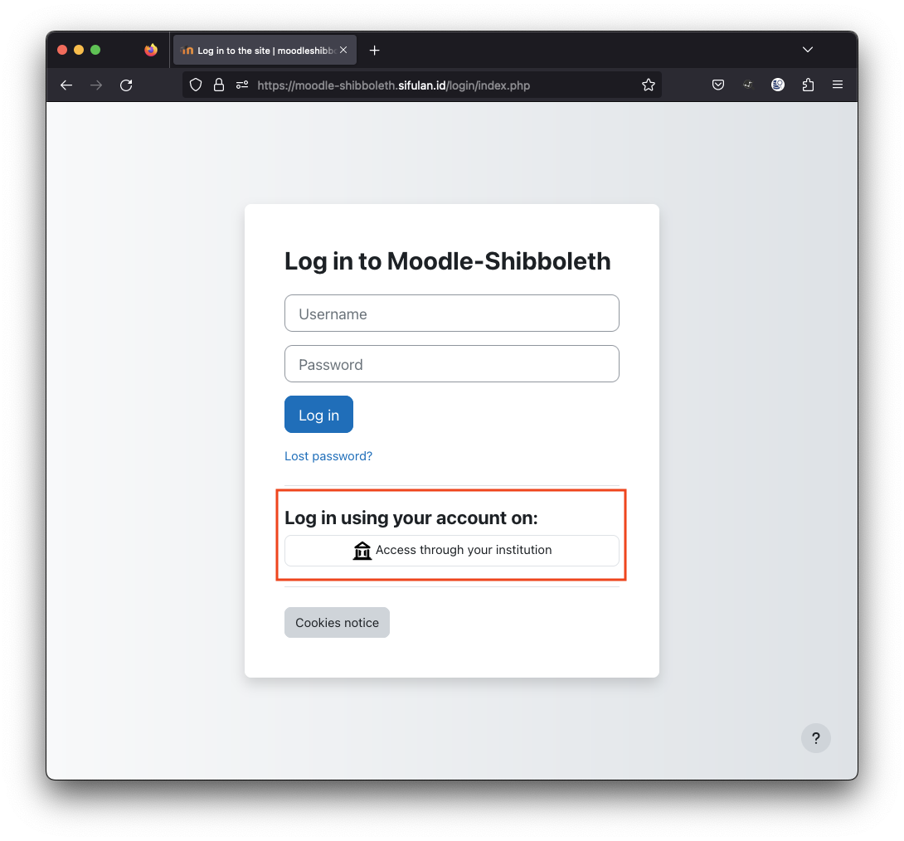

# Moodle - SIFULAN Federation / eduGAIN Integration

## Objective

To integrate Moodle with SIFULAN Federation and eduGAIN

## Outcome

Able to accept login from SIFULAN Federation / eduGAIN Identity Providers (IdPs)

## Introduction

This document provides a guide how to accept login from Identity Federation such as SIFULAN Federation and eduGAIN on Moodle. SIFULAN Federation and eduGAIN use SAML protocol to facilitate the Authentication (AuthN) process. Moodle has a built-in SAML plugin. However, it relies on another software/middleware called Shibboleth Service Provider (Shibboleth SP).  In general, there are 3 steps that we need to do:

1. Install and configure the Shibboleth SP
2. Configure Moodle’s SAML plugin
3. Register the Shibboleth SP metadata to SIFULAN Federation.

This guide assume that the Moodle is already installed on Apache Web Server on Linux and use the https protocol to access it.

## Install Shibboleth SP 

### For CentOS/Rocky Linux

1. Visit: ``https://shibboleth.net/downloads/service-provider/RPMS/`` to generate the yum repo file.
2. Select your OS distro and version, the click the generate button
3. Copy the output, then create the repo file and save it at the ``/etc/yum.repos.d/`` folder, for example:

   ```bash
   sudo vi /etc/yum.repos.d/shibboleth.repo
   ```

4. Update the repositories and install the Shibboleth SP:

   ```bash
   sudo yum update -y
   sudo yum install -y shibboleth
   ```

### For Ubuntu Linux

1. Install the Shibboleth SP:

   ```bash
   sudo apt install libapache2-mod-shib ntp --no-install-recommends
   ```

## Generate Metadata Signing and Encryption Keys

1. Change the current working folder to Shibboleth's configuration folder:

   ```bash
   cd /etc/shibboleth
   ```

2. Create SP metadata Signing and Encryption credentials:

   For CentOS/Rocky Linux:

   ```bash
   sudo ./keygen.sh -u shibd -g shibd -h [moodle hostname] -y 10 -e https://[moodle hostname]/shibboleth -n sp-signing -f
   sudo ./keygen.sh -u shibd -g shibd -h [moodle hostnam] -y 10 -e https://[moodle hostname]/shibboleth -n sp-encrypt –f
    ```
   For Ubuntu Linux:

   ```bash
   sudo shib-keygen -u _shibd -g _shibd -h [moodle hostname] -y 10 -e https://[moodle hostname]/shibboleth -n sp-signing -f
   sudo shib-keygen -u _shibd -g _shibd -h [moodle hostname] -y 10 -e https://[moodle hostname]/shibboleth -n sp-encrypt –f
   ```

   Note:
   - Replace ``[moodle hostname]`` with your Moodle service's hostname (e.g. ``moodle.university.edu.my``)

## Configure Shibboleth SP

All Shibboleth SP configuration files are located at /etc/shibboleth folder. Some key configurations files are:

- [shibboleth2.xml](shibboleth2.xml) : the main configuration file
- [attribute-map.xml](attribute-map.xml) : the attribute mapping configuration file

In addition, you also need to download SIFULAN Federation signer’s key to validate the metadata from SIFULAN Federation’s Metadata Query Service (MDQ) by using the following command:

```bash
sudo wget https://sifulan.my/metadata/sifulan-signer.pem -O /etc/shibboleth/sifulan-signer.pem
```

For simplicity, you can download the preconfigured [shibboleth2.xml](shibboleth2.xml) and [attribute-map.xml](attribute-map.xml).

```bash
sudo wget https://raw.githubusercontent.com/sifulan-access-federation/HowTo/main/Moodle/shibboleth2.xml -O /etc/shibboleth/shibboleth2.xml
sudo wget https://raw.githubusercontent.com/sifulan-access-federation/HowTo/main/Moodle/attribute-map.xml -O /etc/shibboleth/attribute-map.xml
```

You should replace ``[moodle hostname]`` and ``[moodle support email]`` in the [attribute-map.xml](attribute-map.xml) file with the actual hostname and support email of your Moodle service.

Should you change any configuration configuration file, you need to restart the shibd daemon by using the following command:

```bash
sudo systemctl restart shibd.service
```

## Configure Apache

Add the following configuration into your Apache configuration for Moodle:

```bash
<Directory  /var/www/html/auth/shibboleth/index.php>
   AuthType shibboleth
   ShibRequireSession On
   require valid-user
</Directory>

<Directory /var/www/html/auth/shibboleth/logout.php>
   AuthType shibboleth
   ShibRequireSession Off
   require shibboleth
</Directory>
```

You may need to update the directory path according to your Moodle’s root directory path.

Restart/reload your apache service after adding the configuration above.

For CentOS/Rocky Linux:

```bash
sudo systemctl restart httpd
```

For Ubuntu:

```bash
sudo systemctl restart apache2
```

## Moodle SAML Configuration

1. Login into your Moodle as Administrator
2. Go to ``Site administration -> Plugins``
3. At the ``Authentication category``, click on the ``"Manage authentication"``
4. Find ``"Shibboleth"`` and then enable them by clicking on the ``"eye"`` icon.
5. Go to the ``"Common settings"``, set the following values:

   Options | Value 
   --- | --- 
   Prevent account creation when authenticating | untick 

   Then, click on the ``"Save changes"`` button
6. Click on the (``"Shibboleth"``) ``"Settings"``
7. Set the following values:

   Options | Value
   --- | ---
   Username | eduPersonPrincipalName
   Shibboleth Service Provider logout handler URL | /Shibboleth.sso/Logout
   Authentication method name | Access through your institution
   Authentication method logo | upload this [logo](sa-black.svg) file
   Data mapping (First name) | givenName
   Data mapping (Last name) | sn
   Data mapping (Email address) | mail
   Data mapping (Institution) | o

   Then, click on the ``"Save changes"`` button

After the last step, you should be able to see a new login method appear on the login page like the screenshot below:



To login by using SIFULAN Federation or eduGAIN, simply click on the ``"Access through your institution"`` button to initiate the login process. You don't have to manually create an account for user from SIFULAN Federation or eduGAIN IdP. Instead, Moodle will automatically create an account for them by using the user's attributes sent by their respective IdP.

## Exchanging Metadata

You need to provide the Shibboleth SP metadata file to SIFULAN Federation. To do so, you can visit this url:
``https://[moodle’s hostname]/Shibboleth.sso/Metadata`` to download the Shibboleth SP metadata file for your Moodle (replace ``[moodle’s hostname]`` with your Moodle service' hostname). Save the metadata file (e.g. as ``moodle-metadata.xml``), and email it to support@sifulan.my. It may take up to 24 hours for your Shibboleth SP metadata to be fully propagated at SIFULAN Federation and eduGAIN after the request to register the Service Provider is approved.


